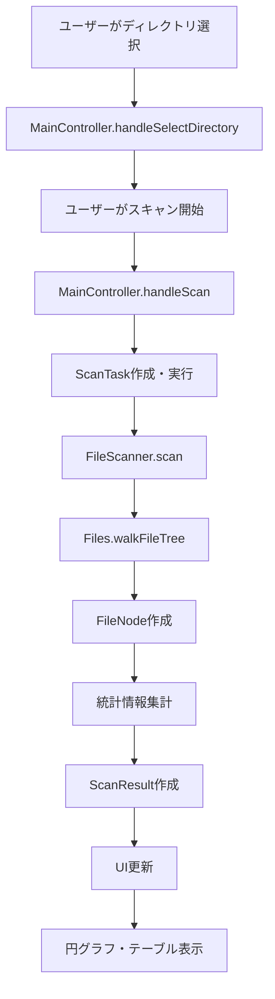
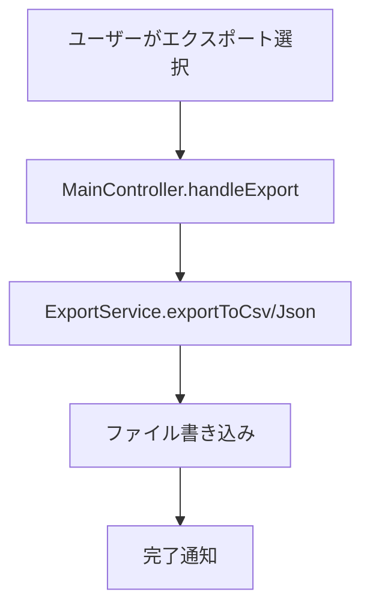

# LumiDisk アーキテクチャ設計書

## 概要

LumiDiskは、ディスク使用量を分析・可視化するJavaFXアプリケーションです。マルチスレッド処理による高速スキャンと、直感的な円グラフ表示を特徴とします。

## システム構成

### 技術スタック

- **言語**: Java 21
- **GUI フレームワーク**: JavaFX 21
- **ビルドツール**: Gradle 9.0
- **ログ**: Logback
- **JSON処理**: Jackson
- **データベース**: SQLite（将来の拡張用）

### アーキテクチャパターン

- **MVC (Model-View-Controller)**: UIとビジネスロジックの分離
- **Service Layer**: ビジネスロジックの集約
- **Repository Pattern**: データアクセスの抽象化（将来実装）

## パッケージ構成

```
com.example.diskanalyzer/
├── MainApp.java                 # アプリケーションエントリーポイント
├── controller/                  # コントローラー層
│   ├── MainController.java      # メイン画面コントローラー
│   └── ScanTask.java           # バックグラウンドスキャンタスク
├── model/                      # モデル層
│   ├── FileNode.java           # ファイル・ディレクトリ情報
│   └── ScanResult.java         # スキャン結果
├── service/                    # サービス層
│   ├── FileScanner.java        # ファイルスキャンサービス
│   └── ExportService.java      # エクスポートサービス
└── util/                       # ユーティリティ
    └── LoggerFactory.java      # ログファクトリー
```

## レイヤー詳細

### 1. プレゼンテーション層 (View)

#### JavaFX UI
- **FXML**: UIレイアウトの定義
- **CSS**: スタイリング（将来実装）
- **コントローラー**: UIイベントの処理

#### 主要コンポーネント
- **メインウィンドウ**: スキャン対象選択、結果表示
- **円グラフ**: ディレクトリサイズ分布の可視化
- **テーブル**: ファイル詳細情報の一覧表示
- **プログレスバー**: スキャン進捗の表示

### 2. コントローラー層 (Controller)

#### MainController
- UIイベントの処理
- ビジネスロジックの呼び出し
- データバインディング

#### ScanTask
- バックグラウンドでのファイルスキャン
- 進捗の更新
- エラーハンドリング

### 3. モデル層 (Model)

#### FileNode
```java
public class FileNode {
  private final Path path;           // ファイルパス
  private final long size;           // サイズ（バイト）
  private final FileTime modified;   // 更新日時
  private final boolean isDirectory; // ディレクトリフラグ
  private final boolean isHidden;    // 隠しファイルフラグ
  private final String extension;    // 拡張子
}
```

#### ScanResult
```java
public class ScanResult {
  private final List<FileNode> files;           // ファイル一覧
  private final Map<String, Long> extensionStats; // 拡張子統計
  private final long totalSize;                 // 総サイズ
  private final int totalFiles;                 // ファイル数
  private final int totalDirectories;           // ディレクトリ数
  private final long scanDuration;              // スキャン時間
}
```

### 4. サービス層 (Service)

#### FileScanner
- **責任**: ファイルシステムのスキャン
- **特徴**: マルチスレッド処理（ForkJoinPool）
- **処理フロー**:
  1. 指定パスの再帰走査
  2. ファイル属性の取得
  3. 統計情報の集計
  4. 結果の返却

#### ExportService
- **責任**: スキャン結果のエクスポート
- **対応形式**: CSV、JSON
- **特徴**: ストリーミング処理

## データフロー

### 1. スキャン処理フロー



### 2. エクスポート処理フロー



## パフォーマンス設計

### 1. マルチスレッド処理

#### ForkJoinPool
- CPUコア数に基づく並列度の自動調整
- ワークスティーリングによる効率的なタスク分散

#### 非同期処理
- JavaFX TaskによるUIスレッドの分離
- 進捗のリアルタイム更新

### 2. メモリ効率

#### ストリーミング処理
- 大量ファイルのメモリ効率的な処理
- ページングによるテーブル表示

#### ガベージコレクション
- 短命オブジェクトの最小化
- 適切なコレクション型の選択

## エラーハンドリング

### 1. 例外階層

```
Exception
├── IOException
│   ├── FileSystemException
│   └── AccessDeniedException
└── RuntimeException
    └── ScanException (カスタム例外)
```

### 2. エラー処理戦略

#### ファイルアクセスエラー
- 権限不足ファイルのスキップ
- ログ出力による問題の記録
- 処理の継続

#### UIエラー
- ユーザーフレンドリーなエラーメッセージ
- 適切なフォールバック処理

## セキュリティ考慮事項

### 1. ファイルアクセス
- 最小権限の原則
- パストラバーサル攻撃の防止

### 2. データ保護
- ログファイルの適切な管理
- 個人情報の取り扱い注意

## 拡張性設計

### 1. プラグインアーキテクチャ
- 将来の機能拡張に対応
- インターフェースベースの設計

### 2. 設定管理
- 外部設定ファイルのサポート
- ユーザー設定の永続化

## テスト戦略

### 1. 単体テスト
- 各サービスクラスのテスト
- モックオブジェクトの活用

### 2. 統合テスト
- エンドツーエンドのテスト
- 実際のファイルシステムを使用

### 3. パフォーマンステスト
- 大量ファイルでの性能測定
- メモリ使用量の監視

## デプロイメント

### 1. パッケージング
- jpackageによるネイティブパッケージ
- Windows (.exe)、macOS (.app) 対応

### 2. 配布
- GitHub Releases
- 自動ビルド・配布パイプライン

## 将来の拡張計画

### 1. 機能拡張
- 重複ファイル検出
- ストレージ整理提案
- 増分スキャン

### 2. 技術的改善
- GraalVM Native Image
- データベース統合
- クラウド連携

## 運用・保守

### 1. ログ管理
- ローテーション設定
- ログレベル調整

### 2. 監視
- パフォーマンスメトリクス
- エラー率の監視

---

**最終更新**: 2025年8月31日  
**バージョン**: 1.0
